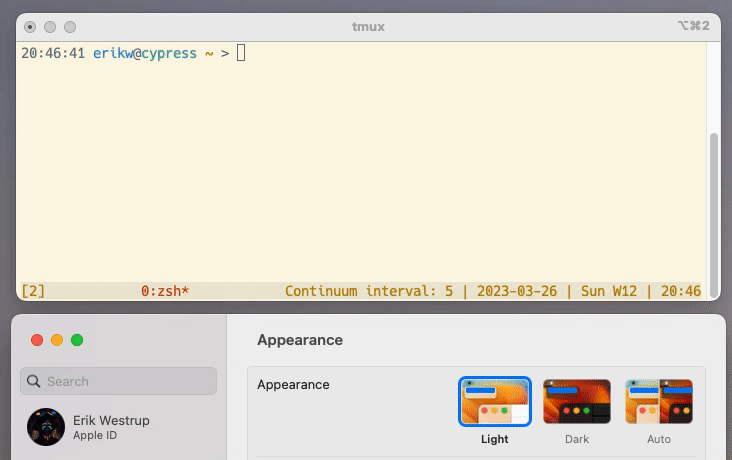

# tmux-dark-notify - Make tmux's theme follow macOS dark/light mode 
[](#)
[](#)
[](LICENSE.txt)
[](https://github.com/Netflix/osstracker)
[](https://github.com/erikw/tmux-powerline/tags)

<p align="center">
    <!-- Ref: https://dev.to/azure/adding-a-github-codespace-button-to-your-readme-5f6l -->
    <a href="https://github.com/codespaces/new?hide_repo_select=true&ref=main&repo=619217443" title="Open in GitHub Codespaces" ></a>
</p>

This tmux [tpm](https://github.com/tmux-plugins/tpm) plugin will change the tmux theme automatically when the system changes the light/dark mode. Configure a light and a dark theme and the plugin will take care of the rest!




For example I use a Solarized in all my programs that support it. For tmux I use [seebi/tmux-colors-solarized](https://github.com/seebi/tmux-colors-solarized) which is locally cloned (in my dotfiles as a submodule). This tmux theme repo provides a light theme `tmuxcolors-light.conf` and a dark theme `tmuxcolors-dark.conf`. With this tmux plugin, I have configured so that when the system appearance mode changes, the corresponding tmux theme will be used.

Hats off to [dark-notify](https://github.com/cormacrelf/dark-notify) which this plugin is built up on!

# Setup
## Requirements
* macOS - dark-notify is only for mac
* Bash
* Homebrew
* [dark-notify](https://github.com/cormacrelf/dark-notify) - `$ brew install cormacrelf/tap/dark-notify`
* tmux
* [tpm](https://github.com/tmux-plugins/tpm) - Tmux Plugin Manager

## Setup steps
1. Make sure all requirements above are installed and working already.
2. Configure tmux-dark-notify in `tmux.conf`
   * To install the plugin, add a line 
     ```conf
      set -g @plugin 'erikw/tmux-dark-notify'
     ```
   * Now you must configure the paths for the light/dark themes you want to use. I personally have [seebi/tmux-colors-solarized](https://github.com/seebi/tmux-colors-solarized) installed as a TPM plugin. NOTE that in the tmux.conf any themes must be set up before tmux-dark-notify, otherwise they might override the theme set by this plugin. . Change the paths below to your themes.
     ```conf
     set -g @dark-notify-theme-path-light '$HOME/.config/tmux/plugins/tmux-colors-solarized/tmuxcolors-light.conf'
     set -g @dark-notify-theme-path-dark '$HOME/.config/tmux/plugins/tmux-colors-solarized/tmuxcolors-dark.conf'
     ```
   * To cover some corner cases e.g. if you use the plugin [tmux-reset](https://github.com/hallazzang/tmux-reset) or another TPM plugin sets the theme itself, I recommend adding this explicit source of the theme as well as a fallback in case this plugin is not run in all scenarios. The `if-shell` condition is there because the symlink won't be there the very first time until tmux-dark-notify has run. It should be placed after TPM is initialized, because the ordering of plugin initialization is not guaranteed. **Remove any other** `source-file` for theme you have of course!
     ```conf
     run-shell '~/.config/tmux/plugins/tpm/tpm' # Or however you source tpm.

     if-shell "test -e ~/.local/state/tmux/tmux-dark-notify-theme.conf" \
	      "source-file ~/.local/state/tmux/tmux-dark-notify-theme.conf"
     ```
   * Thus in summary, the relevant section of you `tmux.conf` could look like this (including the theme I use)
     ```conf
     [...]

     set -g @plugin 'seebi/tmux-colors-solarized'
     set -g @plugin 'erikw/tmux-dark-notify'

     set -g @dark-notify-theme-path-light '$HOME/.config/tmux/plugins/tmux-colors-solarized/tmuxcolors-light.conf'
     set -g @dark-notify-theme-path-dark '$HOME/.config/tmux/plugins/tmux-colors-solarized/tmuxcolors-dark.conf'

     [...]
     run-shell '~/.config/tmux/plugins/tpm/tpm' # Or however you source tpm.

     if-shell "test -e ~/.local/state/tmux/tmux-dark-notify-theme.conf" \
	      "source-file ~/.local/state/tmux/tmux-dark-notify-theme.conf"
     ```
3. Install the plugin with `<prefix>I`, unless you changed [tpm's keybindings](https://github.com/tmux-plugins/tpm#key-bindings).
4. Try toggle the system's appearance mode from System Settings and see that the tmux theme is changing
   * To verify, you can `ls -l ~/.local/state/tmux/tmux-dark-notify-theme.conf` to see that it is linked to the light or dark theme you configured.


# Tips on more light/dark mode configuration
* NeoVim: set up [dark-notify](https://github.com/cormacrelf/dark-notify) to change our nvim theme as well!
* [iTerm2](https://iterm2.com/downloads.html): Use version >=3.5 (currently in beta) as it has support for automatically changing the whole terminal theme between light/dark when the system appearance mode changes. This is what I have in the demo GIF at the top of this file.
  * Go to iTerm2 Preferences > Profiles > your profile > Colors (tab):
    * Check the "Use different colors for light and dark mode"
    * Under "Editing:", chose your light and dark colors (tip: usee the color presets button).
* Global keyboard shortcut: Create a global keyboard shortcut to toggle mode in macOS.
  * Open Automator.app
    * Create a new `Quick Action`.
    * Drag from the list to the left the  "Change System Appearace" to the areaon the rnage, and set "Change Appearance" to "Toggle Light/Dark".
    * Save it e.g. as `apperance_toggle`.
  * Open System Settings > Keyboard > Keyboard shortcuts (button) > Services
    * Find the `apperance_toggle` service we just created under the General category
    * Bind it to a shortcut e.g.  CTRL+OPT+CMD+t (this shortcut was used when feature first appeared in a beta version of macOS).

# Development
## Codespaces Devcontainer
You can fork this project and then start coding right away with GitHub Codespaces as this project is set up to install all development dependencies and install tmux-dark-notify on the devcontainer. See [devcontainer.json](.devcontainer/devcontainer.json) and [devcontainer_postCreateCommand.sh](scripts/devcontainer_postCreateCommand.sh). After starting the devcontainer, just type `tmux` in the terminal and you should see a working tmux-dark-notify already to start playing with.

Note: if you have set up your own dotfiles to be installed with GitHub Codespaces, and there was some tmux config files installed from your dotfiles to the devcontainer, then you might have to run this script to wipe your config in favour of the setup provided by this repo's initialization:

```shell
./scripts/devcontainer_postCreateCommand.sh
```

Note: there is no macOS host image for devcontainers, so we can't actually use dark-notify. However you can manually simulate the change of mode e.g. light->dark by calling the CLI script yourself.:

```shell
tmux # jump in to tmux
./scripts/tmux-theme-mode.sh dark
./scripts/tmux-theme-mode.sh light
```
and you will see how the tmux statusbar theme changes!

# More tmux plugins
I have another tmux plugin that might interest you:
* [tmux-powerline](https://github.com/erikw/tmux-powerline) - A tmux plugin giving you a hackable status bar consisting of dynamic & beautiful looking powerline segments, written purely in bash.
